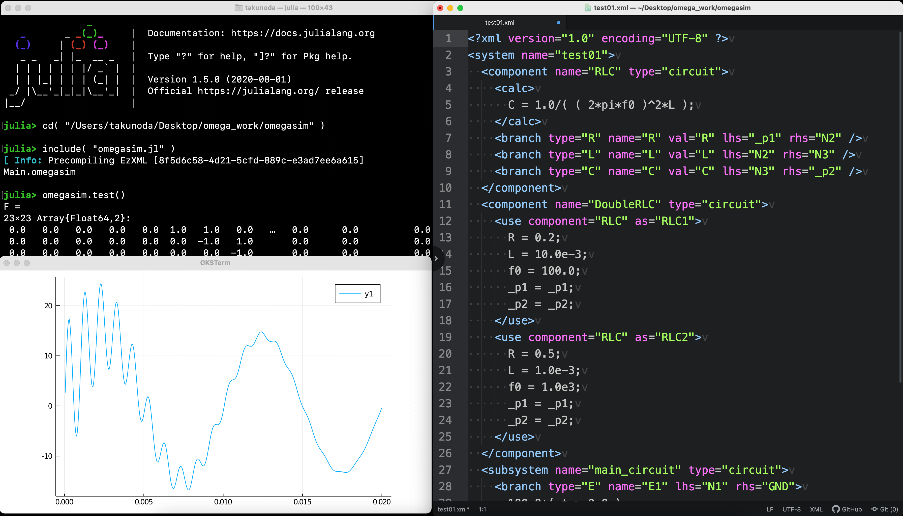

# omegasim

**omegasim** is a [Julia](https://julialang.org/) package for the simulation of composite industrial systems. It is under development but able to simulate a simple system consisting of electrical circuits with the trapezoidal integration method (that is not L-stable). The omegasim package reads a file containing the description of an industrial system in the [Industrial System Description Format (iSDF)](iSDF.md).

The following describes the goal of omegasim (not implemented yet).

omegasim aims at practical simulations of composite industrial systems. A composite system consists of two or more subsystems characterized by different response time scales. In omegasim, different simulation methods are used for subsystems with different response time scales, and inputs and outputs of those subsystems are interconnected for the whole system simulation. This feature is quite reasonable for the simulation of industrial systems which are inherently composed of two or more subsystems with different response time scales. Currently, omegasim has the following two time-domain simulation methods.

1. Transient simulation method.
2. Phasor simulation method.

Before talking about these methods, let us define scientific terms. When a system does not include distributed-parameter elements, then it can be fully described by a set of differential and algebraic equations, or DAEs for short. Differential equations describe the behavior of dynamic elements, whereas algebraic equations describe that of time-independent elements. The equations also describe the relationships among those elements. Since a set of DAEs fully describes a system, it is also called a descriptor system.

The transient simulation method solves the DAEs of a subsystem in a straightforward way with respect to time. Each nonlinearity which exists in the subsystem is represented by a piecewise linear curve, since a nonlinearity is usually given as point-list data for most industrial systems. And the point-list data immediately give a piecewise linear representation. Since a subsystem in an industrial system is often stiff, it must be solved by an L-stable integration scheme which does not produce spurious or non-existing numerical oscillation. An L-stable integration scheme is an implicit scheme, and a set of simultaneous nonlinear equations therefore has to be solved at each time step. The piecewise linear representation of nonlinearity mentioned above is also suitable for solving the set of nonlinear equations. This is because its convergence in the solution process is detected by a fairly simple condition. After all, the transient simulation method is summarized as follows. First, all nonlinearities in the subsystem are represented by piecewise linear curves, and then the resultant set of DAEs is integrated using an L-stable integration scheme of your choice with respect to time by solving the set of piecewise linear equations obtained at each time step.

Considering the overall response time scale, the responses of some subsystems are quite fast and negligible and can be substituted by their steady-state ones. In this case, the steady-state response can be obtained by solving a set of algebraic equations describing the subsystem. The subsystem may operate on a sinusoidal carrier. If this is the case, the solution of the algebraic equations is complex-valued, where its absolute value and argument respectively give the magnitude and phase angle of the sinusoidal carrier. The algebraic equations are solved at each time step and repeated as time evolves, and the solution follows the variation of the sinusoidal carrier with respect to time. This method is often called the phasor simulation method. If the subsystem operates on a dc signal basis, then the solution of its algebraic equations becomes real-valued. This can be considered as a special case of the phasor simulation method.

omegasim uses a constant time step size for all subsystems, since this strategy is reasonable for the simulation of industrial systems. Consider this awkward but real situation. The designers of industrial systems are engineers. When those engineers implement, for instance, a digital PI controller, they use fairly simple numerical integration algorithm such as the forward Euler method, the trapezoidal method and so on with a constant time step. Do we have to use an elaborate numerical integration algorithm with variable time steps for the simulation of such a system, as suggested by applied mathematicians? The answer is of course not. This is the primary reason why I, an engineer, have started creating omegasim.

At each time step, the responses of all subsystems are calculated as their outputs. Then, considering the interconnected topology, those outputs are considered as the inputs to the subsystems with allowing one time step delay. The whole system is divided into subsystems so that the one time step delay does not affect the solution. For industrial systems, this process should not be difficult, since existing subsystems are actually designed to allow one time step delay. So, once the responses of all subsystems have been calculated, the output-to-input interconnection process can be carried out by simple substitutions, and this process is repeated with respect to time so that the response of the whole system is obtained.

To be continued.