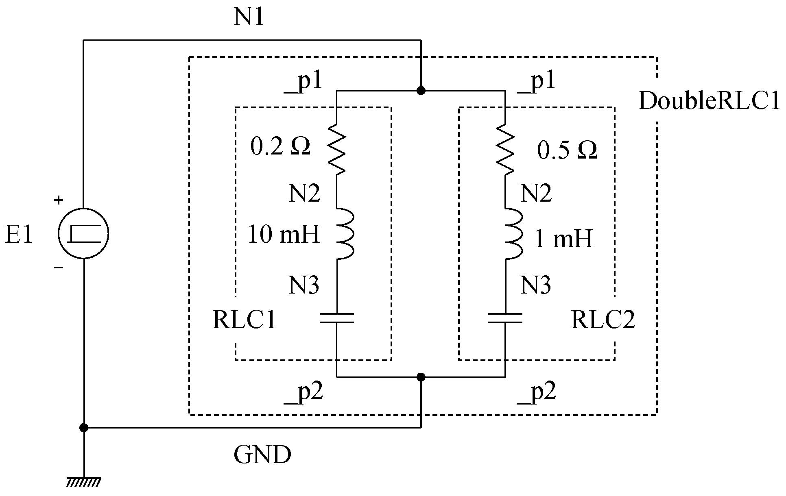

# Industrial System Description Format (iSDF)

## Introduction

The Industrial System Description Format (iSDF) is a data format based on extensible markup language (XML) to describe an industrial system for its simulation and design. The following points give a basic idea of how the iSDF describes an industrial system.

- An industrial system is in general a complex of one or more *subsystems* which are characterized by different response time scales. In most cases, a *subsystem* consists of a physical part embedded with its control part. But, sometimes, a *subsystem* consists only of a physical part or a control part.
- A *subsystem* can also be further divided into smaller functioning units. In the iSDF, they are called *components*. A clear distinction should be made between *subsystems* and *components*. *Subsystems* are lightly coupled and allow time delays in infomration exchange among them as mentioned next. On the other hand, *components* are tightly coupled and do not allow time delays. All *subsystems* are in one layer to form an industrial system, whereas *components* can be nested in layers. To define a *component*, one or more existing *components* can be used.
- When an industrial system consists of more than two *subsystems*, they are interconnected by exchanging information among them. In reality, when information is passed from one to another, a sensor or an actuator which involves some sort of time delay is used. This fact suggests that a time delay can be inserted in the information exchange, thus allowing independent modeling and solution of each *subsystem*.

In the iSDF, a *subsystem* or a *component* must be defined before it is used. So, *components* are first defined. Then, *subsystems* are defined using *components*. Finally, an industrial system is defined by interconnecting *subsystems*.

The rest of this document is organized as follows. First, notation elements such as numbers, name strings and their variables used in the iSDF are introduced. Next, the format for defining an *industrial system* using a *subsystem* is presented (as mentioned in the next paragraph, currently more than one *subsystem* is not allowed, and the information of *subsystems* are not exchanged at this moment). The format for defining a *subsystem* using already-defined *components* follows. Then, the format for defining a *component* is presented. Finally, an example of an *industrial system* description is given.

As of June 2021, there are two limitations in the iSDF. One is that the physical part of a *subsystem* and a *component* is limited to an electrical circuit. So, you can define a *subsystem* or a *component* as a mixture of an electrical circuit and its control system. Later, other domains of physical systems such as mechanical, thermal and so on will be supported. The other is that only one *subsystem* definition is supported. Therefore, information is not exchanged among *subsystems*. These limitations will soon be removed as the iSDF development makes progress, and the format presented here should be considered a temporary one.

## Notation Elements

### Numbers

There are two different types of numbers in iSDF. One is integer, and the other is a real number. Their notations simply follow those of the Julia programming language.

### Name Strings

In an electrical-circuit *component* definition, a *name string* is used to give a name as the name of a branch and that of a node. It starts with an alphabet letter followed by an arbitrary number of letters each of which is an alphabet letter, a digit or an underscore '\_'. An alphabet letter can be lowercase or uppercase. *Name strings* are case sensitive.

### Variables

In a *subsystem* or *component* definition, numerical values can be given by *variables* so that they can be determined when the *component* is used. A *variable* starts with an alphabet letter followed by an arbitrary number of letters each of which is an alphabet letter, a digit or an underscore '\_'. An alphabet letter can be lowercase or uppercase. *Variables* are case sensitive. Note that an underscore is not allowed as the first letter to make a distinction from *string variables*.

### String Variables

In an electrical-circuit *component* definition, its pins are defined as *string variables* so that they can be connected to arbitrary nodes when the *component* is used. A *string variable* starts with an underscore '\_' followed by an arbitrary number of letters each of which is an alphabet letter, a digit or an underscore. *String variables* are case sensitive. *String variables* carry *name strings*.

## Description Format for an Industrial System

It is assumed that an industrial system is a complex of one or more *subsystems*. In an industrial system definition, first come an arbitrary number of *component* definitions with which *subsystems* are defined. Then, *subsystems* are defined and interlinked for exchanging information -- this is the final goal. At this moment, as mentioned earlier, only one *subsystem* definition is allowed, and thus information is not exchanged among *subsystems*.

```XML
<system name="name">
  <component ...>
    ...
  </component>
  ...
  <subsystem ...>
    ...
  </subsystem>
</system>
```

- *name* is set to the name of the industrial system. It must be a *name string*.
- First come an arbitrary number of *component* definitions. The format for a *component* definition will be mentioned later. It should be noted that a *component* must be defined before it is used, and a recursive definition which defines a *component* using itself is not allowed. The format for a *component* definition is given leter.
- Then, only one *subsystem* definition is placed. The format for a *subsystem* definition is given in the next section.

## Description Format for a Subsystem

A *subsystem* is defined by the following format. It should be noted that the physical part of a *subsystem* is limited to an electrical circuit at this moment as mentioned earlier.

```XML
<subsystem name="name" type="circuit">
  <calc>
    variable = Julia expression;
    ...
  </calc>
  <branch> ... </branch>
  ...
  <ctrl> ... </ctrl>
  ...
  <use component="component_name" as="instance_name">
    variable or string variable substitution;
    ...
  </use>
  ...
</subsystem>
```

- *name* is set to the name of this *subsystem*. The name must be a *name string*.
- *type* is set to "circuit" to declare that this is an electrical-circuit *subsystem*.
- A `<calc> ... </calc>` section may be placed. In the `<calc> ... </calc>` section, the values of *variables* are calculated using expressions of the Julia programming language. If a *variable* is used to give the value of a constant in this *subsystem*, that value is calculated here. Or the *variable* can also be used just for the calculation of another *variable*. In the Julia expression, some variables in the right-hand side can be kept undefined. Those values can be specified, when a simulation is started. In the `<calc> ... </calc>` section, more than one *variable* calculation can be placed by inserting a semicolon between two neighbouring *variable* calculations.
- An arbitrary number of `<branch> ... </branch>` sections are placed. A `<branch> ... </branch>` section corresponds to an electrical-circuit branch. The formats for a variety of branches are given later.
- An arbitrary number of `<ctrl> ... </ctrl>` section are placed. A `<ctrl> ... </ctrl>` section corresponds to a control block. The format for a control block is given later.
- An arbitrary number of `<use> ... </use>`  sections are placed. A `<use> ... </use>` section declares to use a *component*, which has been defined earlier, as a part of this *subsystem*. A `<use> ... </use>` section has the two attributes, *component* and *as*. *component* is set to the name of the *component* to be used, and *as* is set to the name of the instance generated by this declaration.
- Inside a `<use> ... </use>` section, an arbitrary number of substitutions are placed. When more than one substitution is placed, neighbouring two substitutions are separated by a semicolon. A substitution can give a value to a *variable* whose value has not given in the component definition. In this case, the form `variable = Julia expression` is used. Or a substitution can give a specific string to a *string variable*. A *string variable* substitution can be distinguished by the fact that the *string variable* starts with a dollar sign "\$". In this case, the form `$variable = "string"` is used.

In the electrical-circuit *subsystem*, the *name string* "GND" is reserved as the node that is directly connected, with no impedance, to the zero potential being the absolute reference of voltages. An independent circuit must have at least one "GND" node in order to avoid undefined node voltages.

Various kinds of electrical-circuit branches are defined in the iSDF, and they are introduced below. After introducing those electrical-circuit branches, how to describe a control block using the Julia programming language is presented. Then, an example for an electrical-circuit *component* is shown.

## Format for an Electrical-Circuit Component

An electrical-circuit *component* is defined by the following format. It should be noted that the physical part of a *component* is limited to an electrical circuit at this moment as mentioned earlier. Other domains such as mechanical, thermal and so on will be supported later.

```xml
<component name="name" type="circuit">
  <calc>
    variable = Julia expression;
    ...
  </calc>
  <branch> ... </branch>
  ...
  <ctrl> ... </ctrl>
  ...
  <use component="component_name" as="instance_name">
    variable or string variable substitution;
    ...
  </use>
  ...
</component>
```

- *name* is set to the name of this *component*. The name must be a *name string*.
- *type* is set to "circuit" to declare that this is an electrical-circuit *component*.

- A `<calc> ... </calc>` section may be placed. In the `<calc> ... </calc>` section, the values of *variables* are calculated using expressions of the Julia programming language. If a *variable* is used to give the value of a constant in this *component*, that value is calculated here. Or the *variable* can also be used just for the calculation of another *variable*. In the Julia expression, some variables in the right-hand side can be kept undefined. Those values can be specified, when a simulation is started. In the `<calc> ... </calc>` section, more than one *variable* calculation can be placed by inserting a semicolon between two neighbouring *variable* calculations.
- An arbitrary number of `<branch> ... </branch>` sections are placed. A `<branch> ... </branch>` section corresponds to an electrical-circuit branch. The formats for a variety of branches are given later.
- An arbitrary number of `<ctrl> ... </ctrl>` section are placed. A `<ctrl> ... </ctrl>` section corresponds to a control block. The format for a control block is given later.
- An arbitrary number of `<use> ... </use>`  sections are placed. A `<use> ... </use>` section declares to use a *component*, which has been defined earlier, as a part of this *subsystem*. A `<use> ... </use>` section has the two attributes, *component* and *as*. *component* is set to the name of the *component* to be used, and *as* is set to the name of the instance generated by this declaration.
- Inside a `<use> ... </use>` section, an arbitrary number of substitutions are placed. When more than one substitution is placed, neighbouring two substitutions are separated by a semicolon. A substitution can give a value to a *variable* whose value has not given in the component definition. In this case, the form `variable = Julia expression` is used. Or a substitution can give a specific string to a *string variable*. A *string variable* substitution can be distinguished by the fact that the *string variable* starts with a dollar sign "\$". In this case, the form `$variable = "string"` is used.

In the electrical-circuit *component*, the *name string* "GND" is reserved as the node that is directly connected, with no impedance, to the zero potential being the absolute reference of voltages. An independent circuit must have at least one "GND" node in order to avoid undefined node voltages.

Various kinds of electrical-circuit branches are defined in the iSDF, and they are introduced in the next section. After introducing those electrical-circuit branches, how to describe a control block using the Julia programming language is presented. Then, an example for an electrical-circuit *component* is shown.

### Linear Circuit Branches

#### Linear Resistor (single phase)

A single-phase linear resistor is described by the following one liner.

```xml
<branch type="R" name="name" val="val" lhs="lhs" rhs="rhs"/>
```

- *type* is set to "R" to declare that this is a linear resistor.
- *name* is set to its name. The name must be a *name string*. 
- *val* is set to its resistance value in ohms by a number or by a *variable*.
- *lhs* is set to the node name to which the lefthand-side terminal of the resistor is connected. The node name can be a name string or a string variable.
- *rhs* is set to the node name to which the righthand-side terminal of the resistor is connected. The node name can be a name string or a string variable.

For example, a linear resistor of 50 ohms, named "R1", and connected from the node "N1" to "N2" is described as follows.

```xml
<branch type="R" name="R1" val="50.0" lhs="N1" rhs="N2"/>
```

#### Linear Resistor (multiphase)

A multiphase linear resistor is described by the following format.

```xml
<branch type="R" nph="nph" name="name">
  <val>
    resistance matrix
  </val>
  <lhs>
    list of lefthand-side node names
  </lhs>
  <rhs>
    list of righthand-side node names
  </rhs>
</branch>
```

- *type* is set to "R" to declare that this is a linear resistor.
- *nph* is set to the number of phases.
- *name* is set to its name. The name must be a *name string*. 
- The resistance matrix in ohms is given in the `<val> ... </val>` section. The columns are separated by spaces, and the rows are separated by semicolons. Each element of the matrix can be a number of a *variable*.
- The list of lefthand-side node names are given in the `<lhs> ... </lhs>` section. Node names are separated by semicolons. Each node name can be a name string or a string variable. Spaces are simply ignored.
- The list of righthand-side node names are given in the `<rhs> ... </rhs>` section. Node names are separated by semicolons. Each node name can be a name string or a string variable. Spaces are simply ignored.

For example, consider a linear three-phase resistor named "R3ph". Its self resistance is 10 ohms and the mutual resistance is 2.5 ohms. It is connected from the nodes "NL1", "NL2", "NL3" to "NR1", "NR2", "NR3".

```xml
<branch type="R" nph="3" name="R3ph">
  <val>
    10.0 2.5 2.5;
    2.5 10.0 2.5;
    2.5 2.5 10.0
  </val>
  <lhs>
    NL1, NL2, NL3
  </lhs>
  <rhs>
    NR1, NR2, NR3
  </rhs>
</branch>
```

#### Linear Inductor (single phase)

A single-phase linear inductor is described by the following one liner.

```xml
<branch type="L" name="name" val="val" lhs="lhs" rhs="rhs"/>
```

- *type* is set to "L" to declare that this is a linear inductor.
- *name* is set to its name. The name must be a *name string*. 
- *val* is set to its inductance value in henrys by a number or by a *variable*.
- *lhs* is set to the node name to which the lefthand-side terminal of the inductor is connected. The node name can be a name string or a string variable.
- *rhs* is set to the node name to which the righthand-side terminal of the inductor is connected. The node name can be a name string or a string variable.

For example, a linear inductor of 100 milli-henrys, named "L1", and connected from the node "N1" to "N2" is described as follows.

```xml
<branch type="L" name="L1" val="100.0e-3" lhs="N1" rhs="N2"/>
```

#### Linear Inductor (multiphase)

A multiphase linear inductor is described by the following format.

```xml
<branch type="L" nph="nph" name="name">
  <val>
    inductance matrix
  </val>
  <lhs>
    list of lefthand-side node names
  </lhs>
  <rhs>
    list of righthand-side node names
  </rhs>
</branch>
```

- *type* is set to "L" to declare that this is a linear inductor.
- *nph* is set to the number of phases.
- *name* is set to its name. The name must be a *name string*. 
- The inductance matrix in henrys is given in the `<val> ... </val>`  section. The columns are separated by spaces, and the rows are separated by semicolons. Each element of the matrix can be a number of a *variable*.
- The list of lefthand-side node names are given in the `<lhs> ... </lhs>` section. Node names are separated by semicolons. Each node name can be a name string or a string variable. Spaces are simply ignored.
- The list of righthand-side node names are given in the `<rhs> ... </rhs>` section. Node names are separated by semicolons. Each node name can be a name string or a string variable. Spaces are simply ignored.

For example, consider a linear two-winding inductor named "L_coupled". Its self inductance is 30 milli-henrys and the mutual inductance is 27 milli-henrys. It is connected from the nodes "NL1", "NL2" to "NR1", "NR2".

```xml
<branch type="L" nph="2" name="L_coupled">
  <val>30.0e-3 27.0e-3; 27.0e-3 30.0e-3</val>
  <lhs>NL1, NL2</lhs>
  <rhs>NR1, NR2</rhs>
</branch>
```

#### Linear Conductance (single phase)

A single-phase linear conductance is described by the following one liner.

```xml
<branch type="G" name="name" val="val" lhs="lhs" rhs="rhs"/>
```

- *type* is set to "G" to declare that this is a linear resistor.
- *name* is set to its name. The name must be a *name string*. 
- *val* is set to its resistance value in mhos by a number or by a *variable*.
- *lhs* is set to the node name to which the lefthand-side terminal of the conductance is connected. The node name can be a name string or a string variable.
- *rhs* is set to the node name to which the righthand-side terminal of the conductance is connected. The node name can be a name string or a string variable.

For example, a linear conductance of 0.02 mhos, named "G1", and connected from the node "N1" to "N2" is described as follows.

```xml
<branch type="G" name="G1" val="0.02" lhs="N1" rhs="N2"/>
```

#### Linear Conductance (multiphase)

A multiphase linear conductance is described by the following format.

```xml
<branch type="G" nph="nph" name="name">
  <val>
    conductance matrix
  </val>
  <lhs>
    list of lefthand-side node names
  </lhs>
  <rhs>
    list of righthand-side node names
  </rhs>
</branch>
```

- *type* is set to "G" to declare that this is a linear conductance.
- *nph* is set to the number of phases.
- *name* is set to its name. The name must be a *name string*. 
- The conductance matrix in mhos is given in the `<val> ... </val>`  section. The columns are separated by spaces, and the rows are separated by semicolons. Each element of the matrix can be a number of a *variable*.
- The list of lefthand-side node names are given in the `<lhs> ... </lhs>` section. Node names are separated by semicolons. Each node name can be a name string or a string variable. Spaces are simply ignored.
- The list of righthand-side node names are given in the `<rhs> ... </rhs>` section. Node names are separated by semicolons. Each node name can be a name string or a string variable. Spaces are simply ignored.

For example, consider a linear three-phase conductance named "G3ph". Its self conductance is 0.1 mhos and the mutual conductance is 0.02 mhos. It is connected from the nodes "NL1", "NL2", "NL3" to "NR1", "NR2", "NR3".

```xml
<branch type="G" nph="3" name="G3ph">
  <val>
    0.1 0.02 0.02;
    0.02 0.1 0.02;
    0.02 0.02 0.1
  </val>
  <lhs>
    NL1, NL2, NL3
  </lhs>
  <rhs>
    NR1, NR2, NR3
  </rhs>
</branch>
```

#### Linear Capacitor (single phase)

A single-phase linear capacitor is described by the following one liner.

```xml
<branch type="C" name="name" val="val" lhs="lhs" rhs="rhs"/>
```

- *type* is set to "C" to declare that this is a linear capacitor.
- *name* is set to its name. The name must be a *name string*. 
- *val* is set to its capacitance value in farads by a number or by a *variable*.
- *lhs* is set to the node name to which the lefthand-side terminal of the capacitor is connected. The node name can be a name string or a string variable.
- *rhs* is set to the node name to which the righthand-side terminal of the capacitor is connected. The node name can be a name string or a string variable.

For example, a linear capacitor of 47 micro-farads, named "C1", and connected from the node "N1" to "N2" is described as follows.

```xml
<branch type="C" name="C1" val="47.0e-6" lhs="N1" rhs="N2"/>
```

#### Linear Capacitor (multiphase)

A multiphase linear capacitor is described by the following format.

```xml
<branch type="C" nph="nph" name="name">
  <val>
    capacitance matrix
  </val>
  <lhs>
    list of lefthand-side node names
  </lhs>
  <rhs>
    list of righthand-side node names
  </rhs>
</branch>
```

- *type* is set to "C" to declare that this is a linear capacitor.
- *nph* is set to the number of phases.
- *name* is set to its name. The name must be a *name string*. 
- The capacitance matrix in farads is given in the `<val> ... </val>`  section. The columns are separated by spaces, and the rows are separated by semicolons. Each element of the matrix can be a number of a *variable*.
- The list of lefthand-side node names are given in the `<lhs> ... </lhs>` section. Node names are separated by semicolons. Each node name can be a name string or a string variable. Spaces are simply ignored.
- The list of righthand-side node names are given in the `<rhs> ... </rhs>` section. Node names are separated by semicolons. Each node name can be a name string or a string variable. Spaces are simply ignored.

For example, consider a linear three-phase capacitor named "Cmat". Its self capacitance is 80 nano-farads and the mutual capacitance is -20 nano-farads. It is connected from the nodes "NL1", "NL2", "NL3" to "NR1", "NR2", "NR3".

```xml
<branch type="C" nph="3" name="Cmat">
  <val>
    80.0e-9 -20.0e-9 -20.0e-9;
    -20.0e-9 80.0e-9 -20.0e-9;
    -20.0e-9 -20.0e-9 80.0e-9
  </val>
  <lhs>
    NL1, NL2, NL3
  </lhs>
  <rhs>
    NR1, NR2, NR3
  </rhs>
</branch>
```

### Nonlinear Circuit Branches

It is assumed in the iSDF that nonlinear characteristics are represented by monotonically-increasing piecewise linear curves. A piecewise linear curve can be described by a point list, which is a sequence of two real numbers. The characteristics outside the leftmost point is linearly extrapolated by the first two points, and that outside the rightmost point is also linearly extraplated by the last two points. At the time of this writing, only single-phase nonlinear elements are supported.

#### Nonlinear Resistor

A nonlinear resistor is described by the following format.

```xml
<branch type="NR" name="name" lhs="lhs" rhs="rhs">
  point list to represent a voltage-current curve
</branch>
```

- *type* is set to "NR" to declare that this is a nonlinear resistor.
- *name* is set to its name. The name must be a *name string*. 
- *lhs* is set to the node name to which the lefthand-side terminal of the nonlinear resistor is connected. The node name can be a name string or a string variable.
- *rhs* is set to the node name to which the righthand-side terminal of the nonlinear resistor is connected. The node name can be a name string or a string variable.
- A point list to represent the voltage-current curve of the nonlinear resistor is given as the content of this `<branch> ... </branch>` section in the form of a matrix. The matrix is of size N by 2, where N is the number of points. Each row is a point. The first column is the voltage, and the second column is the current. The columns are separated by spaces, and the rows are separated by semicolons. The curve must be a monotonically increasing, and the points must be ordered in an ascending order. The voltage-current characteristic outside the leftmost point is linearly extrapolated by the first two points, and that outside the rightmost point is also linearly extraplated by the last two points. It is not recommended to include the origin (0.0, 0.0), unless it is actually a break point.

For example, a nonlinear resistor named "D1" connected from the node "N1" to "N2" is described as follows. It has a diode-like piecewise linear voltage-current curve.

```xml
<branch type="NR" name="D1" lhs="N1" rhs="N2">
  -1.0 -1.0e-6;
  0.7 0.7e-6;
  1.0 0.0300007
</branch>
```

#### Nonlinear Inductor

A nonlinear inductor is described by the following format.

```xml
<branch type="NL" name="name" lhs="lhs" rhs="rhs">
  point list to represent a current-flux curve
</branch>
```

- *type* is set to "NL" to declare that this is a nonlinear inductor.
- *name* is set to its name. The name must be a *name string*. 
- *lhs* is set to the node name to which the lefthand-side terminal of the nonlinear inductor is connected. The node name can be a name string or a string variable.
- *rhs* is set to the node name to which the righthand-side terminal of the nonlinear inductor is connected. The node name can be a name string or a string variable.
- A point list to represent the current-flux curve of the nonlinear inductor as the content of this `<branch> ... </branch>` section in the form of a matrix. The matrix is of size N by 2, where N is the number of points. Each row is a point. The first column is the current, and the second column is the flux. The columns are separated by spaces, and the rows are separated by semicolons. The curve must be a monotonically increasing, and the points must be ordered in an ascending order. The current-flux characteristic outside the leftmost point is linearly extrapolated by the first two points, and that outside the rightmost point is also linearly extraplated by the last two points. It is not recommended to include the origin (0.0, 0.0), unless it is actually a break point.

For example, a nonlinear inductor named "NL1" connected from the node "N1" to "N2" is described as follows. It has a piecewise linear current-flux curve with saturation.

```xml
<branch type="NL" name="NL1" lhs="N1" rhs="N2">
  -50.0 -1.35;
  -2.0 -1.25;
   2.0  1.25;
   50.0  1.35
</branch>
```

#### Nonlinear Capacitor

A nonlinear capacitor is described by the following format.

```xml
<branch type="NC" name="name" lhs="lhs" rhs="rhs">
  point list to represent a charge-voltage curve
</branch>
```

- *type* is set to "NC" to declare that this is a nonlinear capacitor.
- *name* is set to its name. The name must be a *name string*. 
- *lhs* is set to the node name to which the lefthand-side terminal of the nonlinear capacitor is connected. The node name can be a name string or a string variable.
- *rhs* is set to the node name to which the righthand-side terminal of the nonlinear capacitor is connected. The node name can be a name string or a string variable.
- A point list to represent the charge-voltage curve of the nonlinear capacitor is given as the content of this `<branch> ... </branch>` section in the form of a matrix. The matrix is of size N by 2, where N is the number of points. Each row is a point. The first column is the charge, and the second column is the voltage. The columns are separated by spaces, and the rows are separated by semicolons. The curve must be a monotonically increasing, and the points must be ordered in an ascending order. The charge-voltage characteristic outside the leftmost point is linearly extrapolated by the first two points, and that outside the rightmost point is also linearly extraplated by the last two points. It is not recommended to include the origin (0.0, 0.0), unless it is actually a break point.

For example, a nonlinear capacitor named "NC1" connected from the node "N1" to "N2" is described as follows. It has a piecewise linear charge-voltage curve representing space charge increase around a transmission wire due to corona discharge.

```xml
<branch type="NC" name="NC1" lhs="N1" rhs="N2">
  -520.0 -9.3e-6;
  -150.0 -1.2e-6;
   150.0  1.2e-6;
   520.0  9.3e-6
</branch>
```

### Source Branches

#### Voltage Source

A voltage source is described by the following format.

```xml
<branch type="E" name="name" lhs="lhs" rhs="rhs">
  equation to determine the voltage at t
</branch>
```

- *type* is set to "E" to declare that this is a voltage source.
- *name* is set to its name. The name must be a *name string*. 
- *lhs* is set to the node name to which the lefthand-side terminal of the voltage source is connected. The node name can be a name string or a string variable.
- *rhs* is set to the node name to which the righthand-side terminal of the voltage source is connected. The node name can be a name string or a string variable.
- An equation to determine the voltage generated by the voltage source with respect to time t is given as the content of this `<branch> ... </branch>` section. The syntax follows the programming language Julia. It is assumed that the variable t that gives the current time is predefined.

For example, a sinusoidal voltage source named "E1" connected from the node "N1" to "N2" is described as follows. It generates a cosine voltage waveform with an amplitude of 141.4 volts and a phase angle of -30 degrees (= -0.524 radians). omega0 gives the angular frequency of the system frequency defined by the simulation case.

```xml
<branch type="E" name="E1" lhs="N1" rhs="N2">
  141.4*cos( omega0*t - 0.524 )
</branch>
```

#### Current Source

A current source is described by the following format.

```xml
<branch type="J" name="name" lhs="lhs" rhs="rhs">
  equation to determine the current at t
</branch>
```

- *type* is set to "J" to declare that this is a current source.
- *name* is set to its name. The name must be a *name string*. 
- *lhs* is set to the node name to which the lefthand-side terminal of the current source is connected. The node name can be a name string or a string variable.
- *rhs* is set to the node name to which the righthand-side terminal of the current source is connected. The node name can be a name string or a string variable.
- An equation to determine the current generated by the current source with respect to time t is given as the content of this `<branch> ... </branch>` section.  The syntax follows the programming language Julia. It is assumed that the variable t that gives the current time is predefined.

For example, a square wave dc current source named "J1" connected from the node "N1" to "N2" is described as follows. It starts generating a 5 ampares of dc current at t = 2 seconds and ends at 5 seconds. According to one of the XML rules, "&&" is replaced with "\&amp;\&amp;".

```xml
<branch type="J" name="J1" lhs="N1" rhs="N2">
  5.0*( ( 2.0 < t )&amp;&amp;( t <= 5.0 ) )
</branch>
```

### Time Controlled Switch

A time controlled switch is described by the following format.

```xml
<branch type="Sw" name="name" lhs="lhs" rhs="rhs">
  list of closing and opening time points
</branch>
```

- *type* is set to "Sw" to declare that this is a time-controlled switch.
- *name* is set to its name. The name must be a *name string*. 
- *lhs* is set to the node name to which the lefthand-side terminal of the switch is connected. The node name can be a name string or a string variable.
- *rhs* is set to the node name to which the righthand-side terminal of the switch is connected. The node name can be a name string or a string variable.
- A list of closing and opening time points is given as the content of this `<branch> ... </branch>` section. First comes the first closing time, and then opening time, closing time, and so on follow in turn. Those values are separated by spaces. If the switch is initially closed, the first time is set to a negative time. The number of closing and opening time points is arbitrary.

For example, a time controlled switch named "Sw1" connected from the node "N1" to "N2" is described as follows. It closes at t = 0.5 seconds, opens at t = 1.2 seconds and then closes again at t = 1.8 seconds.

```xml
<branch type="Sw" name="Sw1" lhs="N1" rhs="N2">
  0.5, 1.2, 1.8
</branch>
```

### Controlled Branches

In order to control an electrical circuit from a control part, the following branches accept control signal from a control part so as to change their behavior.

#### Controlled Resistor

A controlled resistor (single-phase) is described by the following one liner.

```xml
<branch type="CR" name="name" ctrl="ctrl" inival="inival" lhs="lhs" rhs="rhs"/>
```

- *type* is set to "CR" to declare that this is a controlled resistor.
- *name* is set to its name. The name must be a *name string*. 
- *ctrl* is set to the name of a control block which gives the resistance value in ohms to this resistor.
- *inival* is used to set the inital resistance value of this resistor. It is used until a resistance value is received from the control block designated by *ctrl* mentioned earlier.
- *lhs* is set to the node name to which the lefthand-side terminal of the resistor is connected. The node name can be a name string or a string variable.
- *rhs* is set to the node name to which the righthand-side terminal of the resistor is connected. The node name can be a name string or a string variable.

For example, a controlled resistor, named "CR1", and connected from the node "N1" to "N2" is described as follows. Its resistance value is controled by the control block "ctrl1", and the initial value is set to 50.0 ohms.

```xml
<branch type="CR" name="CR1" ctrl="ctrl1" inival="50.0" lhs="N1" rhs="N2"/>
```

#### Controlled Switch

A controlled switch is described by the following one liner.

```xml
<branch type="CSw" name="name" ctrl="ctrl" inistate="inistate" lhs="lhs" rhs="rhs"/>
```

- *type* is set to "CSw" to declare that this is a controlled switch.
- *name* is set to its name. The name must be a *name string*. 
- *ctrl* is set to the name of a control block which gives the state of this switch. A positive value corresponds to the closed state, and zero or a negative value corresponds to the open state. It may be convenient to use 1 as the closed state and 0 as the open state.
- *inistate* is used to set the inital state of this switch. It is used until a switch state is received from the control block designated by *ctrl* mentioned earlier.
- *lhs* is set to the node name to which the lefthand-side terminal of the switch is connected. The node name can be a name string or a string variable.
- *rhs* is set to the node name to which the righthand-side terminal of the switch is connected. The node name can be a name string or a string variable.

For example, a controlled switch, named "CSw1", and connected from the node "N1" to "N2" is described as follows. Its state is controled by the control block "ctrl1", and the initial state is open.

```xml
<branch type="CSw" name="CSw1" ctrl="ctrl1" inistate="0" lhs="N1" rhs="N2"/>
```

#### Controlled Voltage Source

A controlled voltage source is described by the following one liner.

```xml
<branch type="CE" name="name" ctrl="ctrl" inival="inival" lhs="lhs" rhs="rhs"/>
```

- *type* is set to "CE" to declare that this is a controlled voltage source.
- *name* is set to its name. The name must be a *name string*. 
- *ctrl* is set to the name of a control block which gives the voltage value in volts to this voltage source.
- *inival* is used to set the inital value of this voltage source in volts. It is used until a voltage value is received from the control block designated by *ctrl* mentioned earlier.
- *lhs* is set to the node name to which the lefthand-side terminal of the voltage source is connected. The node name can be a name string or a string variable.
- *rhs* is set to the node name to which the righthand-side terminal of the voltage source is connected. The node name can be a name string or a string variable.

For example, a controlled voltage source, named "CE1", and connected from the node "N1" to "N2" is described as follows. Its value is controled by the control block "ctrl1", and the initial value is 0.0.

```xml
<branch type="CE" name="CE1" ctrl="ctrl1" inival="0.0" lhs="N1" rhs="N2"/>
```

#### Controlled Current Source

A controlled current source is described by the following one liner.

```xml
<branch type="CJ" name="name" ctrl="ctrl" inival="inival" lhs="lhs" rhs="rhs"/>
```

- *type* is set to "CJ" to declare that this is a controlled current source.
- *name* is set to its name. The name must be a *name string*. 
- *ctrl* is set to the name of a control block which gives the current value in ampares to this current source.
- *inival* is used to set the inital value of this current source in ampares. It is used until a current value is received from the control block designated by *ctrl* mentioned earlier.
- *lhs* is set to the node name to which the lefthand-side terminal of the current source is connected. The node name can be a name string or a string variable.
- *rhs* is set to the node name to which the righthand-side terminal of the current source is connected. The node name can be a name string or a string variable.

For example, a controlled current source, named "CJ1", and connected from the node "N1" to "N2" is described as follows. Its value is controled by the control block "ctrl1", and the initial value is -1.0.

```xml
<branch type="CJ" name="CJ1" ctrl="ctrl1" inival="-1.0" lhs="N1" rhs="N2"/>
```

### Probes for Control

The voltage across a branch or the current flowing through a branch can be obtained as an input to a control part by specifying the name of the branch without a probe. But a voltage between two nodes and a current flowing from and to more than onr branch require a probe branch. In order to obtain such a voltage or a current value as an input to a control part, the following probes are used.

#### Voltage Probe

A voltage probe is described by the following one liner.

```xml
<branch type="VP" name="name" lhs="lhs" rhs="rhs"/>
```

- *type* is set to "VP" to declare that this is a voltage probe.
- *name* is set to its name. The name must be a *name string*. 
- *lhs* is set to the node name to which the lefthand-side terminal of the probe is connected. The node name can be a name string or a string variable.
- *rhs* is set to the node name to which the righthand-side terminal of the probe is connected. The node name can be a name string or a string variable.

For example, a voltage probe named "VP1" and connected from the node "N1" to "N2" is described as follows.

```xml
<branch type="VP" name="VP1" lhs="N1" rhs="N2"/>
```

#### Current Probe

A current probe is described by the following one liner.

```xml
<branch type="CP" name="name" lhs="lhs" rhs="rhs"/>
```

- *type* is set to "CP" to declare that this is a current probe.
- *name* is set to its name. The name must be a *name string*. 
- *lhs* is set to the node name to which the lefthand-side terminal of the probe is connected. The node name can be a name string or a string variable.
- *rhs* is set to the node name to which the righthand-side terminal of the probe is connected. The node name can be a name string or a string variable.

For example, a current probe named "CP1" and connected from the node "N1" to "N2" is described as follows.

```xml
<branch type="CP" name="CP1" lhs="N1" rhs="N2"/>
```

### Control Blocks

A control block is described by the following format.

```xml
<ctrl name="name">
  <input>list of input variables</input>
  <output>one line Julia code</output>
</ctrl>
```

- *name* is set to its name. The name must be a *name string*. 
- The list of input variables to this control block is given in the `<input> ... </input>` section. The variables are separated by commas. If the voltage across a branch is needed as an input variable, it is written in the form v{*name*} with *name* being the name of the branch. If the current flowing through a branch is needed, then the form i{*name*} is used. If the output of another control block is needed as an input, simply specify the name of that control block.
- The calculation procedure of this control block is given in the `<output> ... </output>` section as one line Julia code. The result of the calculation becomes the output of this block. For details, consult the Programming Details in Julia section of this document.

For example, a control block named "ctrl1" getting the output of the control block "ctrl2" as the input is described as follows. This control block multiplies 5.0 to the input, and the calculation result becomes the output of this control block.

```xml
<ctrl name="ctrl1">
  <input>ctrl2</input>
  <output>5.0*ctrl2</output>
</ctrl>
```

### Component of Components

As mentioned earlier in the description of the format for an electrical-circuit component, the format can include an arbitrary number of `<use> ... </use>` sections. This means that a component can be defined using already-existing components and allows building-block development of components. The following rules apply, when already-existing components are used.

- A component must be defined before it is used. In other words, the definition of a component must be placed earlier in a file than its use.
- A component can be used as many times as required with different parameter values. The parameter values are given by substitutions placed in the  `<use> ... </use>` section.

For those who are familiar with object-oriented programming, it is easier to understand this concept by replacing the definition of a component by a class definition and the use of a component by generating an instance out of its class definition.

## Example of an Industrial System Description

In the following iSDF example, first, a series RLC circuit is defined as the component named RLC. It is assumed that the values of the resistor R, the inductor L and the oscillation frequency f0 are given when it is used. The value of the capacitor C is calculated from L and f0 so that the oscillation frequency matches f0. Then, in the definition of the component DoubleRLC, two instances of RLC are generated as RLC1 and RLC2. The oscillation frequency of RLC1 is set to 100 Hz, and that of RLC2 is set to 1 kHz. The two series RLC circuits are connected in parallel to form DoubleRLC. Finally, an instance of DoubleRLC is generated as DoubleRLC1 and excited by the step voltage source E1, which generates 100 V at t = 0.

```xml
<?xml version="1.0" encoding="UTF-8" ?>
<system name="test01">
  <component name="RLC" type="circuit">
    <calc>
      C = 1.0/( ( 2*pi*f0 )^2*L );
    </calc>
    <branch type="R" name="R" val="R" lhs="_p1" rhs="N2" />
    <branch type="L" name="L" val="L" lhs="N2" rhs="N3" />
    <branch type="C" name="C" val="C" lhs="N3" rhs="_p2" />
  </component>
  <component name="DoubleRLC" type="circuit">
    <use component="RLC" as="RLC1">
      R = 0.2;
      L = 10.0e-3;
      f0 = 100.0;
      _p1 = _p1;
      _p2 = _p2;
    </use>
    <use component="RLC" as="RLC2">
      R = 0.5;
      L = 1.0e-3;
      f0 = 1.0e3;
      _p1 = _p1;
      _p2 = _p2;
    </use>
  </component>
  <subsystem name="main_circuit" type="circuit">
    <branch type="E" name="E1" lhs="N1" rhs="GND">
      100.0*( t > 0.0 )
    </branch>
    <use component="DoubleRLC" as="DoubleRLC1">
      _p1 = "N1";
      _p2 = "GND";
    </use>
  </subsystem>
</system>
```

The following figure shows the circuit diagram of the example.



## Copyright Notice
Copyright 2021 Central Research Institute of Electric Power Industry

Permission is hereby granted, free of charge, to any person obtaining a copy of this software and associated documentation files (the "Software"), to deal in the Software without restriction, including without limitation the rights to use, copy, modify, merge, publish, distribute, sublicense, and/or sell copies of the Software, and to permit persons to whom the Software is furnished to do so, subject to the following conditions:

The above copyright notice and this permission notice shall be included in all copies or substantial portions of the Software.

THE SOFTWARE IS PROVIDED "AS IS", WITHOUT WARRANTY OF ANY KIND, EXPRESS OR IMPLIED, INCLUDING BUT NOT LIMITED TO THE WARRANTIES OF MERCHANTABILITY, FITNESS FOR A PARTICULAR PURPOSE AND NONINFRINGEMENT. IN NO EVENT SHALL THE AUTHORS OR COPYRIGHT HOLDERS BE LIABLE FOR ANY CLAIM, DAMAGES OR OTHER LIABILITY, WHETHER IN AN ACTION OF CONTRACT, TORT OR OTHERWISE, ARISING FROM, OUT OF OR IN CONNECTION WITH THE SOFTWARE OR THE USE OR OTHER DEALINGS IN THE SOFTWARE.

Document prepared by Taku Noda and update on June 29, 2021.
